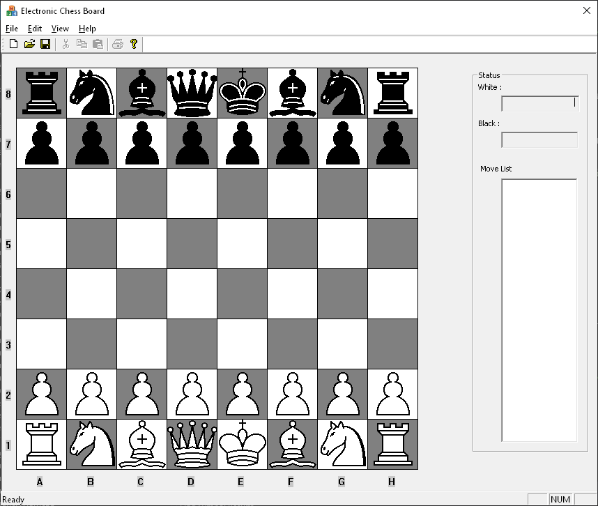

This programs is a electronic chess board wich lets to play chess for two people trough the tcp/ip network.
It has been developped for learning purpose. Even it is about 20 years old code, it is still possible to compile it with Visual Studio + MFC library.

#Usage

Two players may run the software.

White Player
* Open File/Connect
* Write player name
* Select Wait for Connection
* Press OK
* Wait the other player connects to the software
* Do the move or write a message to black player.

Black Player
* Open File/Connect
* Write player name
* Select Connect To Game
* Write ip addres of whait player
* Press OK
* Wait the white players do the move or send a message to the white player.
